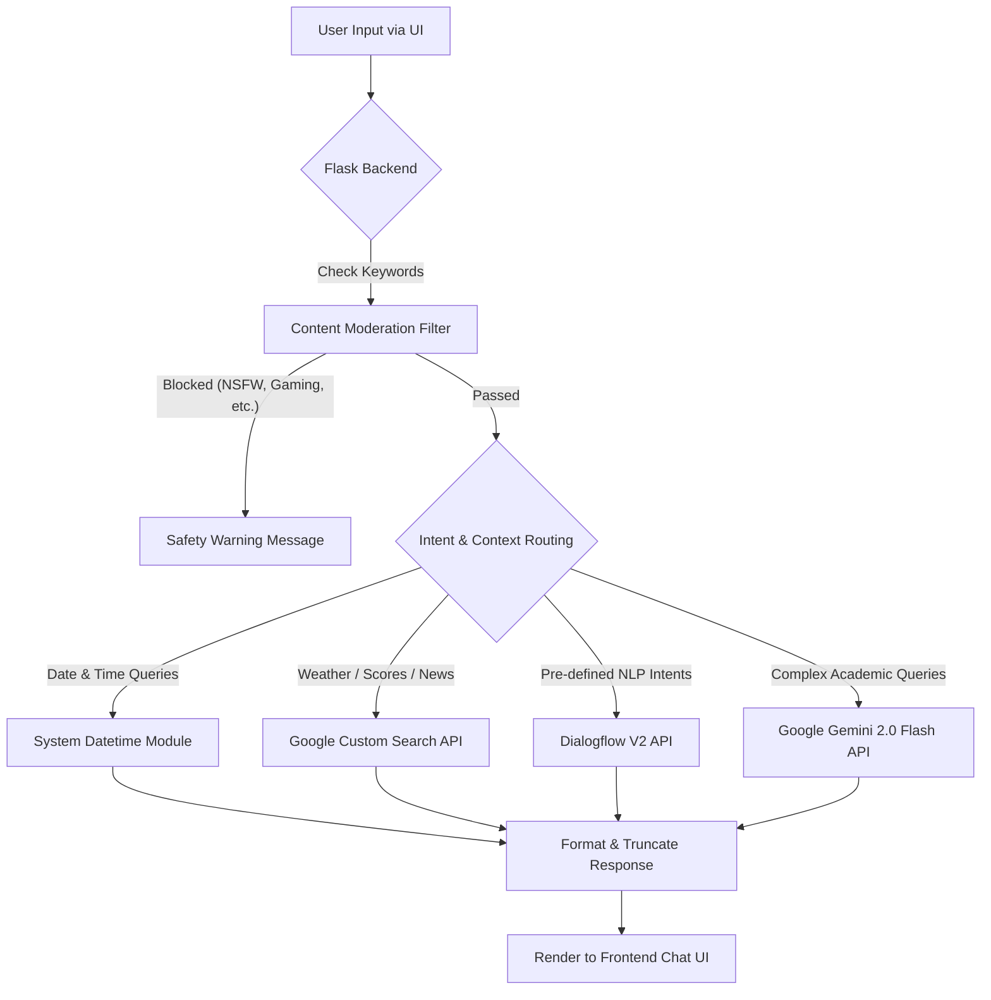

<div align="center">
  
  
  <h1>🌟 Neo Nova </h1>
  <p><strong>Your Futuristic Educational Assistant</strong></p>

  <!-- Tech Stack Badges -->
  <p>
    <a href="https://python.org"></a>
    <a href="https://flask.palletsprojects.com/"></a>
    <a href="https://cloud.google.com/dialogflow"></a>
    <a href="https://ai.google.dev/"></a>
    <a href="https://developers.google.com/custom-search"></a>
    <a href="https://developer.mozilla.org/en-US/docs/Web/JavaScript"></a>
  </p>
</div>

---

**Neo Nova** is an AI-powered smart chatbot designed to function as an educational assistant. Integrated with Dialogflow, the Gemini 2.0 Flash API, and Google Custom Search, it answers academic queries, retrieves real-time data, and holds natural conversations while strictly adhering to school curricula.

---

## ⚙️ Working Architecture

Neo Nova uses a multi-layered routing system to provide the most accurate and safe response.



---

## ✨ Key Features

- 🎨 **Web-based Chatbot Interface:** A sleek, futuristic UI for seamless user interactions.
- 🧠 **Intelligent Responses:** Powered by **Google Gemini 2.0 Flash** for contextual, academic answers.
- 🗣️ **Natural Language Understanding:** Utilizes **Dialogflow v2** to detect user intent.
- 🌍 **Real-time Search Integration:** Uses **Google Custom Search** for live queries like weather, sports scores, and news.
- 🛡️ **Content Moderation:** Built-in keyword filters to ensure conversations remain strictly educational and safe.
- 🕒 **Real-time Date & Time Support:** Instantly handles local time and date queries without API overhead.

---

## 📂 Folder Structure

```text
├── app.py                   # Main Flask backend application
├── requirements.txt         # Python dependencies
├── .env                     # Environment variables (not tracked in Git)
├── index.html               # Chatbot UI
├── style.css                # Interface Styling
├── script.js                # Frontend logic & API requests
├── N.jpg                    # App Logo (Served dynamically)
├── .gitignore               # Ignored files/folders
├── assets/                  # UI Screenshots and static assets
└── docs/                    # Project reports and presentations
```

---

## 🚀 Getting Started

### Prerequisites

Ensure you have the following installed:
- [Python 3.10+](https://www.python.org/downloads/)
- A Google Cloud Platform (GCP) Account with billing enabled (for API access)

### Setup & Installation

1. **Clone the repository:**
   ```bash
   git clone https://github.com/adityasahani001/Neo-nova
   cd neo-nova-chatbot
   ```

2. **Create a Virtual Environment (Recommended):**
   ```bash
   python -m venv venv
   # On Windows:
   venv\Scripts\activate
   # On macOS/Linux:
   source venv/bin/activate
   ```

3. **Install Dependencies:**
   ```bash
   pip install -r requirements.txt
   ```

4. **Environment Variables Configuration:**
   Create a `.env` file in the root directory and add the following keys:
   ```ini
   DIALOGFLOW_PROJECT_ID=your_dialogflow_project_id
   GOOGLE_APPLICATION_CREDENTIALS=your_service_account.json
   GEMINI_API_KEY=your_gemini_api_key
   GOOGLE_SEARCH_KEY=your_google_custom_search_key
   GOOGLE_SEARCH_CX=your_search_engine_id
   ```

5. **Service Account Setup:**
   Ensure you place your Google Service Account JSON key in the project root and reference its exact filename in the `.env` file (`GOOGLE_APPLICATION_CREDENTIALS`).

### Running the Application

To start the Flask development server:
```bash
python app.py
```
Then open your browser and navigate to: `http://127.0.0.1:5000/`

---

## 🛡️ Content Safety

Neo Nova is equipped with a strict keyword moderation list. Any queries containing inappropriate or non-educational topics will automatically trigger a safety warning (`⚠️ Educational use only. Please ask curriculum-aligned questions.`), ensuring the platform remains safe for students.

---

## 🤝 Contributing & Collaboration

We would love to collaborate! Whether it's fixing bugs, improving the UI, or adding new features, your contributions are always welcome.

- 🐛 **Found a bug?** Open an [issue](https://github.com/adityasahani001/Neo-nova/issues).
- ✨ **Have a feature idea?** Submit a [pull request](https://github.com/adityasahani001/Neo-nova/pulls).
- 💬 **Want to discuss?** Feel free to reach out!

---

## 👨‍💻 Author & Connect

**Built with ❤️ by Aditya Sahani**

Let's connect and build something awesome together:
- 💼 [LinkedIn](https://www.linkedin.com/in/aditya-sahani-0955b02ab/)
- 🐙 [GitHub](https://github.com/adityasahani001)
- 📧 [Email Me](mailto:aditya.sahani.cs27@iilm.edu)

---

## 📄 License

This project is proudly licensed under the **MIT License**. Feel free to use, modify, and distribute!
